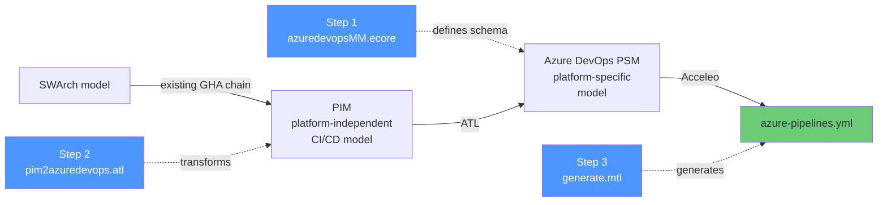
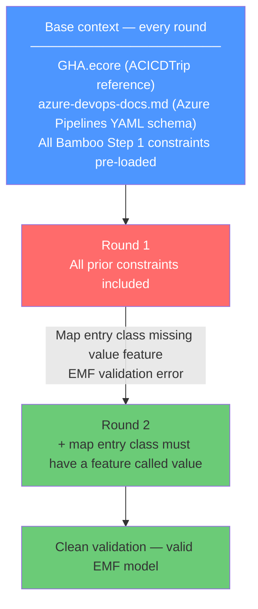
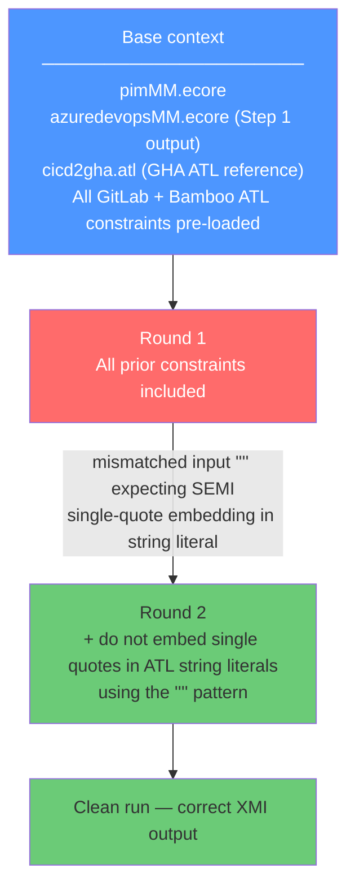
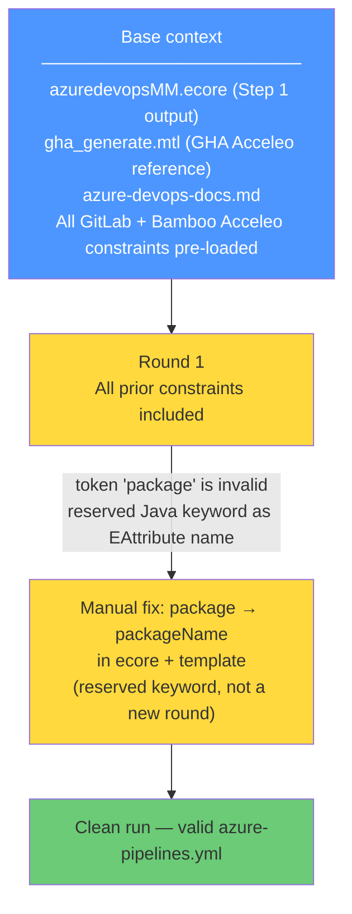

# Experiment Results — LLM-Assisted MDE Artifact Generation for Azure DevOps Pipelines

## What we did

We used an LLM (Claude) to generate all three MDE artifacts needed to transform a
platform-independent CI/CD model into an `azure-pipelines.yml` file. Each artifact was
generated from scratch using only context provided in the prompt. All constraints
accumulated from the GitLab and Bamboo experiments were pre-loaded from round 1.

---

## Navigation

- Step links are placed inside each step section (Step 1, Step 2, Step 3) for easier reading.
- Test case folders: [test1-chatbot](test1-chatbot/), [test2-all-pim](test2-all-pim/), [test3-hello-java](test3-hello-java/)

---

## The MDE pipeline

---

## Step 1 — Metamodel (`azuredevopsMM.ecore`)

**2 rounds.**

**Round links**

- Round 1: [prompt](step1-metamodel-generation/round1/prompt.md), [notes](step1-metamodel-generation/round1/notes.md)
- Round 2: [prompt](step1-metamodel-generation/round2/prompt.md), [notes](step1-metamodel-generation/round2/notes.md)

|                     |                                               |
| ------------------- | --------------------------------------------- |
| Context given       | GHA metamodel + Azure Pipelines docs          |
| Output              | Step 1 Round 2 output.ecore                   |
| Manual fixes        | Renamed EAttribute `package` → `packageName` (reserved keyword) |

All three Bamboo Step 1 constraints held. One new issue: the LLM modelled a variable
map entry class without the required `value` EAttribute. One constraint resolved it.
An additional manual rename was needed (`package` → `packageName`) discovered during
Step 3 compilation — not a new round but noted here.

---

## Step 2 — ATL Transformation (`pim2azuredevops.atl`)

**2 rounds.**

**Round links**

- Round 1: [prompt](step2-atl-generation/round1/prompt.md), [notes](step2-atl-generation/round1/notes.md)
- Round 2: [prompt](step2-atl-generation/round2/prompt.md), [notes](step2-atl-generation/round2/notes.md)

All five pre-loaded ATL constraints held. One new issue: the LLM attempted to build
`variables['name']` by embedding single quotes using ATL's `''''` escape pattern.
ATL's parser cannot resolve token boundaries in this pattern and fails with a compile
error. One constraint resolved it.

---

## Step 3 — Acceleo Template (`generate.mtl`)

**1 round (with one manual fix).**

**Round links**

- Round 1: [prompt](step3-acceleo-generation/round1/prompt.md), [notes](step3-acceleo-generation/round1/notes.md)

All five pre-loaded Acceleo constraints held. The reserved keyword `package` used as
an EAttribute name caused a compile error in the Acceleo template. Fixed by renaming
the attribute in the ecore and updating the single reference in the template. This was
treated as a manual fix rather than a new round since it was a trivial one-line rename
traceable to a Step 1 naming decision.

---

## Cross-step summary

|               |      Step 1       |       Step 2       |      Step 3      |
| ------------- | :---------------: | :----------------: | :--------------: |
| Artifact      | Ecore metamodel   | ATL transformation | Acceleo template |
| Rounds needed |      **2**        |       **2**        |      **1**       |
| Total         |                   |                    |      **5**       |

Round counts: GitLab 11 → Bamboo 6 → Azure DevOps 5. The decrease continues as the
accumulated constraint library grows.

---

## Generated examples

Three test cases exercise the full chain end to end.

| Test             | Entry point               | Input                                    | Jobs | Link |
| ---------------- | ------------------------- | ---------------------------------------- | ---- | ---- |
| test1-chatbot    | swarch → pim → psm → yaml | chatbot framework swarch model           | 4 (build, unitTest, healthCheck, push) | [test1-chatbot](test1-chatbot/) |
| test2-all-pim    | pim → psm → yaml          | 11-job model exercising all PIM concepts | 11 (install-deps, lint, test-unit, test-integration, build, etc.) | [test2-all-pim](test2-all-pim/) |
| test3-hello-java | swarch → pim → psm → yaml | hello-java-ci swarch model               | 3 (build, unitTest, lintCheck) | [test3-hello-java](test3-hello-java/) |

---

## Evaluation — ACICDTrip PIM concept coverage

| ACICDTrip PIMM Concept  | Complete | Correct | Executable | Notes                                                                                      |
| ----------------------- | :------: | :-----: | :--------: | ------------------------------------------------------------------------------------------ |
| Pipeline                |   Full   |   Yes   |    Yes     | name, trigger, pr, schedules, variables, pool all mapped                                   |
| Job                     |   Full   |   Yes   |    Yes     | job, displayName, dependsOn, pool, container, timeoutInMinutes, continueOnError correct    |
| Matrix                  |   Full   |   Yes   |    Yes     | strategy.matrix with named entries generated correctly                                     |
| Agent                   |   Full   |   Yes   |    Yes     | pool.vmImage and container.image both mapped correctly                                     |
| Services                | Partial  |   Yes   |    Yes     | postgres service mapped; redis service absent                                              |
| Trigger                 | Partial  | Partial | Partial    | trigger and pr correct; cron expression truncated (same ATL bug as Bamboo)                |
| Parameters              |   Full   |   Yes   |    Yes     | parameters block with type, default, values generated correctly                            |
| Steps                   | Partial  |   Yes   |    Yes     | ScriptStep and CacheTask(Cache@2) correct; ConditionalStep not mapped                     |
| Expressions / Variables |   Full   |   Yes   |    Yes     | pipeline- and job-level variables correct; ${VAR} references preserved                    |

**Summary:** 5/9 PIMM concepts fully covered. 3 partially covered. 1 not mapped
(ConditionalStep — no Azure DevOps native construct). Azure DevOps covers Matrix fully,
which Bamboo did not — a platform capability difference, not a generation difference.

---

## Gap analysis

### ATL bug (carried from Bamboo — not fixed)

- **CronTrigger expression truncation** — `t.crons->first()` on a String attribute
  returns the first character. Produces five separate single-character schedule entries
  instead of one full cron expression. Same root cause as Bamboo. Fix: reference
  `t.expression` directly.

### Platform scope gap

- **ConditionalStep** — no native Azure DevOps YAML construct for script-level
  if/else branching. Not mapped, same as Bamboo and GitLab.

### Partial coverage

- **Services** — only the first service (postgres) mapped; redis absent. Same
  pattern as GitLab — services collection partially traversed in ATL.

---

## Key findings

1. **Constraint transfer continues to reduce rounds.** Azure DevOps required 5 total
   rounds against 6 for Bamboo and 11 for GitLab. Every pre-loaded constraint held
   with no regressions across all three steps.

2. **New errors are genuinely new.** The two new issues (map entry value feature,
   single-quote ATL embedding) had not appeared in either prior experiment. Both were
   isolated to Azure DevOps-specific modelling patterns and resolved in one round each.

3. **Platform capability differences show in coverage, not round count.** Azure DevOps
   supports Matrix natively; Bamboo does not. This produced a Full coverage rating for
   Matrix in Azure DevOps vs None in Bamboo — with no additional rounds required.

4. **Reserved keyword propagation across layers.** The `package` attribute name was
   accepted by EMF (valid in ecore) but blocked Acceleo compilation. A constraint
   banning Java/Acceleo reserved words as EAttribute names would prevent this class
   of error at Step 1 before it reaches Step 3.
