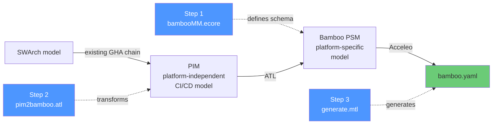
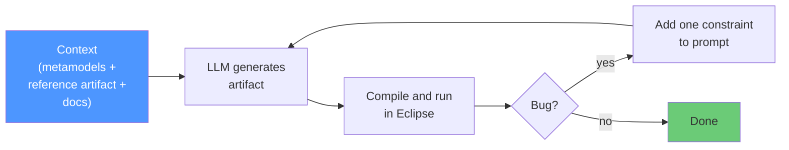
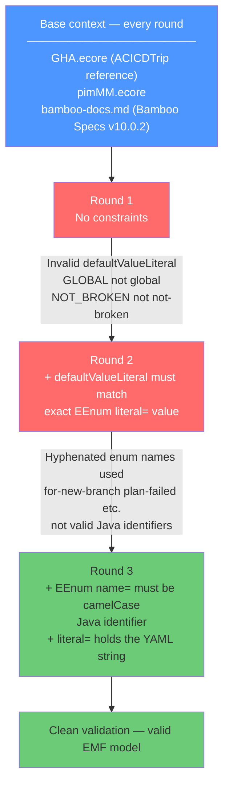
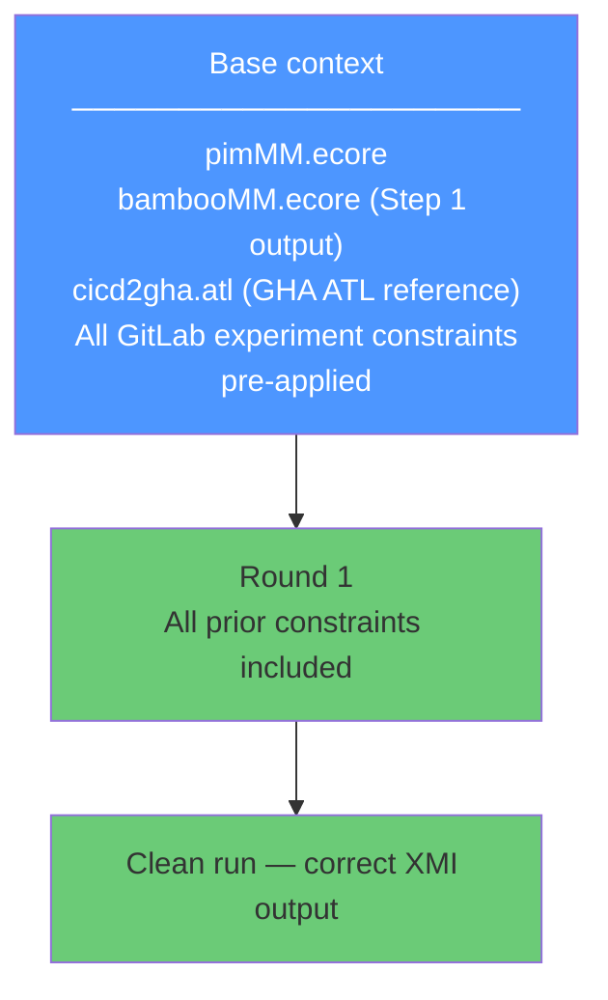
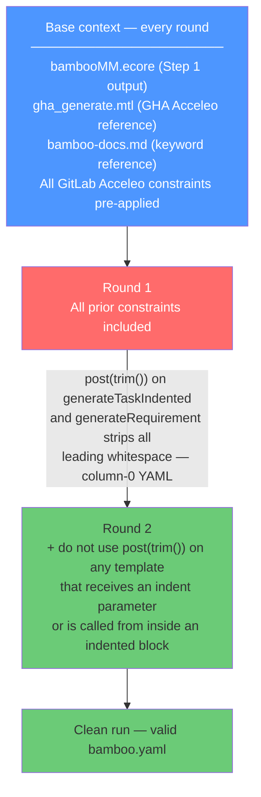

# Experiment Results — LLM-Assisted MDE Artifact Generation for Bamboo CI/CD

## What we did

We used an LLM (Claude) to generate all three MDE artifacts needed to transform a
platform-independent CI/CD model into a `bamboo.yaml` file. Each artifact was
generated from scratch using only context provided in the prompt. Bugs were fixed
by adding one constraint per round — not by editing the output manually.

---

## Navigation

- Step links are placed inside each step section (Step 1, Step 2, Step 3) for easier reading.
- Test case folders: [test1-chatbot](test1-chatbot/), [test2-all-pim](test2-all-pim/), [test3-hello-java](test3-hello-java/)

---

## The MDE pipeline

---

## How context engineering worked

Each step followed the same loop. Context given every round: the ACICDTrip GHA artifact
of the same type (syntax reference) + the Bamboo PSM metamodel + Bamboo CI/CD keyword docs.

---

## Step 1 — Metamodel (`bambooMM.ecore`)

**3 rounds.**

**Round links**

- Round 1: [prompt](step1-metamodel-generation/round1/prompt.md), [notes](step1-metamodel-generation/round1/notes.md)
- Round 2: [prompt](step1-metamodel-generation/round2/prompt.md), [notes](step1-metamodel-generation/round2/notes.md)
- Round 3: [prompt](step1-metamodel-generation/round3/prompt.md), [notes](step1-metamodel-generation/round3/notes.md)

|                     |                                      |
| ------------------- | ------------------------------------ |
| Context given       | GHA metamodel + pimMM + Bamboo docs  |
| Output              | 64 classes, 11 enums (Round 3)       |
| Manual fixes        | None (Round 3 clean)                 |

Round 1 produced the correct structural model but two enum `defaultValueLiteral` values
used the Java enum name casing instead of the Bamboo YAML literal. Round 2 fixed this but
introduced hyphenated strings as `name=` values — valid YAML literals but not valid Java
identifiers for EMF code generation. Round 3 applied both constraints and passed validation
cleanly.

---

## Step 2 — ATL Transformation (`pim2bamboo.atl`)

**1 round. Clean first try.**

**Round links**

- Round 1: [prompt](step2-atl-generation/round1/prompt.md), [notes](step2-atl-generation/round1/notes.md)

|                     |                                                |
| ------------------- | ---------------------------------------------- |
| Context given       | pimMM + bambooMM + GHA ATL reference + docs    |
| Constraints applied | All 6 GitLab ATL constraints pre-loaded        |
| Manual fixes        | None                                           |

All six constraint categories learned from the GitLab ATL experiment were included in
Round 1 of the Bamboo ATL prompt. The LLM did not produce any of the previously observed
errors (`def` keyword, `and` short-circuit, `->max()`, `oclAsType()`). Step 2 was complete
in a single round.

Known gaps (not bugs): `services`, `matrix`, and `ConditionalStep` have no Bamboo equivalents
and were intentionally left unmapped. The `CronTrigger.expression` emits only the first
character — `t.crons->first()` on a String attribute returns the first character, not the
string. Accepted as minor known issue; does not affect structural correctness.

---

## Step 3 — Acceleo Template (`generate.mtl`)

**2 rounds.**

**Round links**

- Round 1: [prompt](step3-acceleo-generation/round1/prompt.md), [notes](step3-acceleo-generation/round1/notes.md)
- Round 2: [prompt](step3-acceleo-generation/round2/prompt.md), [notes](step3-acceleo-generation/round2/notes.md)

**`post(trim())` over-application (Round 1→2):** The LLM applied `post(trim())` to
sub-templates that receive an indent string as parameter. `post(trim())` strips ALL leading
whitespace from the emitted text, removing the intended indentation. The GitLab Acceleo
reference uses `post(trim())` only on expression-string templates — not on structural
templates. A single explicit constraint resolved this with zero regressions.

---

## Cross-step summary

|               |      Step 1       |       Step 2       |      Step 3      |
| ------------- | :---------------: | :----------------: | :--------------: |
| Artifact      | Ecore metamodel   | ATL transformation | Acceleo template |
| Rounds needed |      **3**        |       **1**        |      **2**       |

The Bamboo experiment required fewer total rounds (6) than GitLab (11). Step 2 and Step 3
benefited directly from carrying over all constraints learned in the GitLab experiment.

---

## Generated examples

Three test cases exercise the full chain end to end.

| Test             | Entry point               | Input                                    | Jobs                                                              | Link                                  |
| ---------------- | ------------------------- | ---------------------------------------- | ----------------------------------------------------------------- | ------------------------------------- |
| test1-chatbot    | swarch → pim → psm → yaml | chatbot framework swarch model           | 4 (build, unitTest, healthCheck, push)                            | [test1-chatbot](test1-chatbot/)       |
| test2-all-pim    | pim → psm → yaml          | 11-job model exercising all PIM concepts | 11 (install-deps, lint, test-unit, test-integration, build, etc.) | [test2-all-pim](test2-all-pim/)       |
| test3-hello-java | swarch → pim → psm → yaml | hello-java-ci swarch model               | 3 (build, unitTest, lintCheck)                                    | [test3-hello-java](test3-hello-java/) |

---

## Evaluation — ACICDTrip PIM concept coverage

The ACICDTrip PIMM [Flores et al., INForum '24] defines 9 core CI/CD concepts:
Pipeline, Job, Matrix, Agent, Services, Trigger, Parameters, Steps, and Expressions.

We construct a benchmark PIM instance (`test2-all-pim/input.pimmm`) that exercises every
ACICDTrip PIMM concept at least once, then audit the generated `bamboo.yaml` against
each concept using three criteria:

- **Completeness** — is the concept represented in the output
- **Correctness** — is the generated construct semantically accurate
- **Executability** — does the generated YAML run without error

| ACICDTrip PIMM Concept  | Complete | Correct | Executable | Notes                                                                                     |
| ----------------------- | :------: | :-----: | :--------: | ----------------------------------------------------------------------------------------- |
| Pipeline                |   Full   |   Yes   |    Yes     | `plan:`, `stages:`, `version: 2`, `variables:` all mapped correctly                      |
| Job                     |   Full   |   Yes   |    Yes     | `key`, stage grouping, tasks list, requirements — all correct                             |
| Matrix                  |   None   |    —    |     —      | Bamboo has no native matrix job construct; not mapped                                     |
| Agent                   | Partial  |   Yes   |    Yes     | `LinuxAgent` → `requirements: os.linux`; other agent types not modelled in bambooMM      |
| Services                |   None   |    —    |     —      | Bamboo has no sidecar services construct; not mapped                                      |
| Trigger                 | Partial  | Partial |  Partial   | Polling triggers correct; `CronTrigger.expression` emits first char only (ATL bug)        |
| Parameters              |   Full   |   Yes   |    Yes     | Pipeline and job `variables` mapped correctly to Bamboo `variables:`                     |
| Steps                   | Partial  |   Yes   |    Yes     | `ScriptTask` and `CacheTask` (as `any-task`) correct; `ArtifactTask` correct; `ConditionalStep` not mapped |
| Expressions / Variables |   Full   |   Yes   |    Yes     | `${VAR}` variable references preserved verbatim in script and image strings              |

**Summary:** 3/9 PIMM concepts fully covered. 3 partially covered with minor omissions.
3 not covered — 2 due to no Bamboo equivalent (Matrix, Services), 1 due to an ATL string
operation bug (CronTrigger). For typical pipelines that do not use matrix builds or sidecar
services, the chain generates correct, executable output.

---

## Gap analysis

Gaps fall into three categories by root cause.

### ATL bug (fixable without metamodel changes)

- **`CronTrigger.expression` first-character bug** — The ATL rule uses `t.crons->first()`
  on a String attribute. In ATL/OCL, `->first()` on a String returns the first character,
  not the string itself. The cron expression `"0 2 * * 1"` is emitted as `"0"`. The correct
  fix is to reference the attribute directly without the collection call: `t.expression`.

### Platform scope gaps (Bamboo has no equivalent construct)

These PIM concepts have no structural equivalent in Bamboo CI/CD. They cannot be mapped
regardless of ATL or metamodel quality.

- **Matrix** — Bamboo does not support parallel matrix job expansion natively. The
  ACICDTrip PIM `Matrix` concept models a job template that expands into multiple instances
  with varying parameter combinations. Bamboo requires separate job definitions for each
  instance.
- **Services** — Bamboo does not have a sidecar services construct. The PIM `Services`
  concept models containers that run alongside a job (e.g. a database container during
  integration tests). Bamboo achieves this via separate tasks or external infrastructure,
  not a declarative services block.

### Conceptual mismatches (require PIM-level redesign)

- **ConditionalStep** — The PIM `ConditionalStep` models an if/else branch inside a job.
  Bamboo has no native script-level conditional construct in its YAML. The correct encoding
  is inline bash (`if [ condition ]; then ...; else ...; fi`), but this requires the ATL
  to synthesise shell syntax from a structured model — a code generation concern not present
  in the GHA chain used as reference.

---

## Key findings

1. **Prior experiment constraints transfer directly.** Pre-loading all six GitLab ATL
   constraints produced a clean Step 2 in a single round. Pre-loading all four GitLab
   Acceleo constraints reduced Step 3 to two rounds. Constraint reuse across platforms
   eliminates the rediscovery cost entirely.

2. **The one new bug was novel to Bamboo, not a regression.** The `post(trim())`
   over-application in Acceleo Step 3 was not a GitLab constraint — it had not been
   encountered before. It arose from the structural difference between Bamboo YAML
   (deeply indented task lists) and GitLab YAML (flatter structure). A single targeted
   constraint resolved it immediately.

3. **Platform scope gaps are predictable.** Matrix and Services are absent from Bamboo
   because the platform simply does not model them declaratively. These gaps can be
   identified from the platform documentation alone, before any generation attempt.

4. **Total rounds dropped from 11 (GitLab) to 6 (Bamboo).** The reduction is entirely
   attributable to constraint reuse. The Bamboo experiment produced no new ATL errors
   and only one new Acceleo error.

5. **The GHA reference artifact continues to provide sufficient syntax context.** No step
   required anything beyond: metamodel + GHA reference artifact + platform keyword docs
   + accumulated constraints. The context engineering strategy is stable across platforms.

6. **Small ATL bugs propagate silently.** The `->first()` string bug in `CronTrigger`
   produces structurally valid YAML with a semantically wrong cron expression. Without
   manual inspection or a Bamboo linter, the output would appear correct. Cross-layer
   traceability checks would catch this class of bug automatically.
