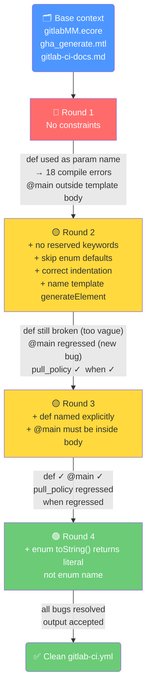

# Step 3 — Acceleo Template Generation: Experiment Results

## What this step does

Takes the GitLab PSM model (output of Step 2 ATL transformation) and generates a
valid `.gitlab-ci.yml` file using an Acceleo model-to-text template. The LLM was
asked to write this template from scratch, with only context provided via the prompt.
Each round added one new constraint to fix a bug found in the previous round.

---

## Context provided (fixed across all rounds)

| Artifact | Purpose |
|---|---|
| `gitlabMM.ecore` | GitLab PSM metamodel — class/attribute names |
| `gha_generate.mtl` | ACICDTrip GHA Acceleo template — syntax reference |
| `gitlab-ci-docs.md` | GitLab CI/CD keyword reference — YAML output format |

---

## Round-by-round progression

---

## Bug tracker

| Bug | R1 | R2 | R3 | R4 |
|---|:---:|:---:|:---:|:---:|
| `def` as template parameter (compile error) | ❌ | ❌ | ✅ | ✅ |
| `[comment @main/]` outside template body | ⚠️ | ❌ | ✅ | ✅ |
| `pull_policy: always` on every image | ❌ | ✅ | ❌ | ✅ |
| `when: on_success` on every job | ❌ | ✅ | ❌ | ✅ |
| `default` block over-indented | ❌ | ❌ | ✅ | ✅ |

> ⚠️ = bug present but not yet observed &nbsp; ❌ = broken &nbsp; ✅ = fixed

---

## Key findings

**Vague constraints don't work.** "Avoid reserved keywords" did not prevent `def`.
Naming the exact forbidden token in Round 3 fixed it permanently.

**Enum handling requires two separate constraints.** First: don't use `oclIsUndefined()`
on enum attributes (Round 2). Second: `toString()` returns the ecore `literal=` value
(lowercase), not the Java enum `name` (uppercase) — so comparisons must use the
literal string (Round 4). Getting the first without the second caused a regression.

**Recency bias.** Constraints placed after long reference files stick better.
All constraints in this step were placed at the end of the prompt (after the GHA
template reference), consistent with the ATL Round 6 finding.

**Compiles first try from Round 3 onward.** Once `def` was named explicitly,
no further manual fixes were needed.
