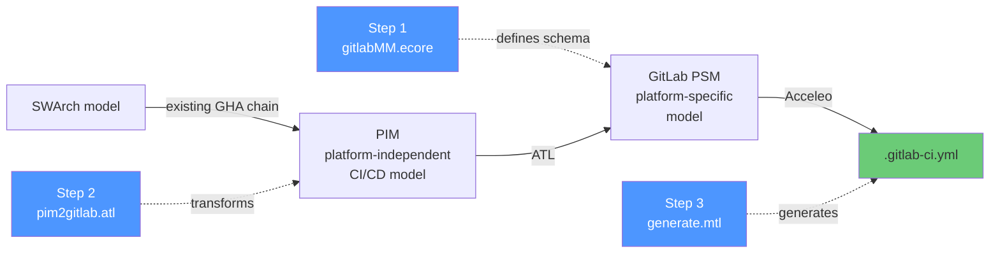
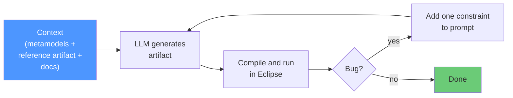
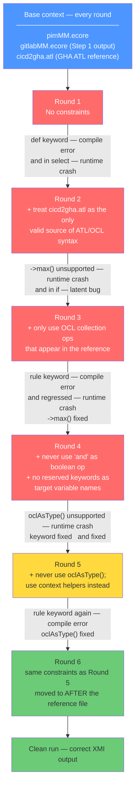
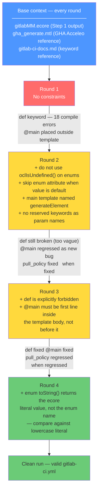

# Experiment Results — LLM-Assisted MDE Artifact Generation for GitLab CI/CD

## What we did

We used an LLM (Claude) to generate all three MDE artifacts needed to transform a
platform-independent CI/CD model into a `.gitlab-ci.yml` file. Each artifact was
generated from scratch using only context provided in the prompt. Bugs were fixed
by adding one constraint per round — not by editing the output manually.

---

## The MDE pipeline

---

## How context engineering worked

Each step followed the same loop. Context given every round: the ACICDTrip GHA artifact
of the same type (syntax reference) + the GitLab PSM metamodel + GitLab CI/CD keyword docs.

---

## Step 1 — Metamodel (`gitlabMM.ecore`)

**1 round. Clean first try.**

| | |
|---|---|
| Context given | GHA metamodel + GitLab CI/CD docs |
| Output | 20 classes, 6 enums |
| Class name accuracy | 20/20 |
| Manual fixes | None |

The LLM correctly filtered GitHub-specific constructs without being told to.
It chose a flatter design than the GHA reference (e.g. `script : EString[*]`
instead of `Script → Command[*]`) — a valid simplification that downstream steps built on.

---

## Step 2 — ATL Transformation (`pim2gitlab.atl`)

**6 rounds.**

**Recency bias (Round 6):** The reserved keyword bug (`def` → `rule` → `rule`) persisted
through Rounds 1, 3, and 5 despite an explicit constraint. In Round 6 the only change was
moving all constraints to after the 754-line ATL reference, immediately before the task.
The bug disappeared. Constraint placement matters as much as constraint content.

---

## Step 3 — Acceleo Template (`generate.mtl`)

**4 rounds.**

**Enum regression (Round 3→4):** The LLM compared `toString()` against the enum name
(`'ALWAYS'`) but Acceleo returns the ecore literal (`'always'`). Two constraints were
needed — one for the semantics (skip defaults) and one for the API detail (use the literal).

---

## Cross-step summary

| | Step 1 | Step 2 | Step 3 |
|---|:---:|:---:|:---:|
| Artifact | Ecore metamodel | ATL transformation | Acceleo template |
| Rounds needed | **1** | **6** | **4** |
| Compile errors round 1 | 0 | 1 | 18 |
| Runtime errors round 1 | 0 | 1 | 1 |
| Manual fixes | 0 | 1 | 0 |
| Class name accuracy | 20/20 | 15/15 | 19/19 |

---

## Key findings

1. **Domain knowledge transfers cleanly.** All class names, YAML keys, and structural
   mappings were correct from Round 1 in every step. Errors were never about understanding
   GitLab CI/CD — always about tool-specific quirks.

2. **The bugs are tool quirks, not domain gaps.** Every error came from ATL/Acceleo
   behaviour that differs from mainstream OCL/Java: `and` not short-circuit,
   `->max()` unsupported, `oclAsType()` unsupported, enum `toString()` returning
   the literal not the name, `def`/`rule` as reserved keywords.

3. **Vague constraints don't stick.** "Avoid reserved keywords" did not stop `def` or
   `rule`. "Use only OCL operations from the reference" did not stop `and`. Every
   constraint that worked named the exact forbidden construct explicitly.

4. **Recency bias is measurable.** Moving identical constraints to after a long reference
   file eliminated a 3-round recurring bug immediately. Instruction placement in
   long-context prompts is a controllable variable with a measurable effect.

5. **Three context artifacts were sufficient for all steps.** Metamodel + syntax reference
   + keyword docs. No step required anything beyond this base set plus targeted constraints.
