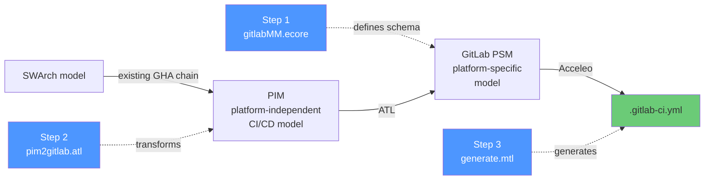
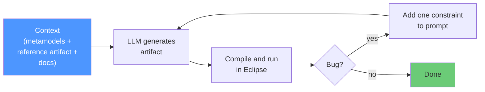
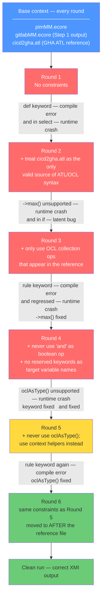
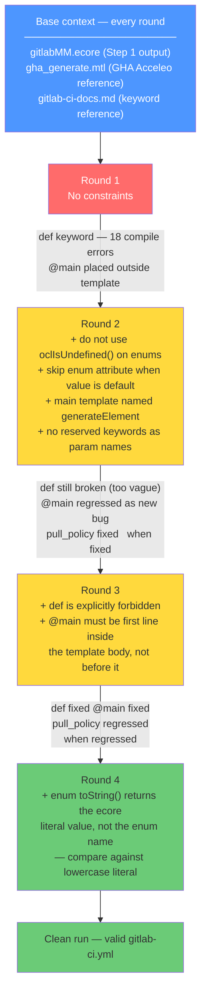

# Experiment Results — LLM-Assisted MDE Artifact Generation for GitLab CI/CD

## What we did

We used an LLM (Claude) to generate all three MDE artifacts needed to transform a
platform-independent CI/CD model into a `.gitlab-ci.yml` file. Each artifact was
generated from scratch using only context provided in the prompt. Bugs were fixed
by adding one constraint per round — not by editing the output manually.

---

## The MDE pipeline

---

## How context engineering worked

Each step followed the same loop. Context given every round: the ACICDTrip GHA artifact
of the same type (syntax reference) + the GitLab PSM metamodel + GitLab CI/CD keyword docs.

---

## Step 1 — Metamodel (`gitlabMM.ecore`)

**1 round. Clean first try.**

| | |
|---|---|
| Context given | GHA metamodel + GitLab CI/CD docs |
| Output | 20 classes, 6 enums |
| Class name accuracy | 20/20 |
| Manual fixes | None |

The LLM correctly filtered GitHub-specific constructs without being told to.
It chose a flatter design than the GHA reference (e.g. `script : EString[*]`
instead of `Script → Command[*]`) — a valid simplification that downstream steps built on.

---

## Step 2 — ATL Transformation (`pim2gitlab.atl`)

**6 rounds.**

**Recency bias (Round 6):** The reserved keyword bug (`def` → `rule` → `rule`) persisted
through Rounds 1, 3, and 5 despite an explicit constraint. In Round 6 the only change was
moving all constraints to after the 754-line ATL reference, immediately before the task.
The bug disappeared. Constraint placement matters as much as constraint content.

---

## Step 3 — Acceleo Template (`generate.mtl`)

**4 rounds.**

**Enum regression (Round 3→4):** The LLM compared `toString()` against the enum name
(`'ALWAYS'`) but Acceleo returns the ecore literal (`'always'`). Two constraints were
needed — one for the semantics (skip defaults) and one for the API detail (use the literal).

---

## Cross-step summary

| | Step 1 | Step 2 | Step 3 |
|---|:---:|:---:|:---:|
| Artifact | Ecore metamodel | ATL transformation | Acceleo template |
| Rounds needed | **1** | **6** | **4** |
| Compile errors round 1 | 0 | 1 | 18 |
| Runtime errors round 1 | 0 | 1 | 1 |
| Manual fixes | 0 | 1 | 0 |
| Class name accuracy | 20/20 | 15/15 | 19/19 |

---

## Generated examples

Three test cases exercise the full chain end to end.

| Test | Entry point | Input | Jobs | Link |
|---|---|---|---|---|
| test1-chatbot | swarch → pim → psm → yaml | chatbot framework swarch model | 4 (build, test, healthcheck, push) | [test1-chatbot](test1-chatbot/) |
| test2-all-pim | pim → psm → yaml | 11-job model exercising all PIM concepts | 11 (matrix, services, DAG, triggers, artifacts, cache, conditionals) | [test2-all-pim](test2-all-pim/) |
| test3-hello-java | swarch → pim → psm → yaml | hello-java-ci swarch model | 3 (build, unitTest, lintCheck) | [test3-hello-java](test3-hello-java/) |

---

## Evaluation — PIM concept coverage

The benchmark model (`test2-all-pim/input.pimmm`) instantiates every concept in the PIM
metamodel. The generated output was audited against each concept using three criteria:

- **Completeness** — is the concept present in the output
- **Correctness** — is the generated construct semantically accurate
- **Executability** — does the generated YAML run without error

| PIM Concept | Complete | Correct | Executable | Notes |
|---|:---:|:---:|:---:|---|
| Job, Stage, Script | Yes | Yes | Yes | Core pipeline — fully works |
| Image / Agent | Yes | Yes | Yes | |
| DAG ordering (`needs`) | Yes | Yes | Yes | |
| Variables (pipeline + job) | Yes | Yes | Yes | |
| Matrix builds | Yes | Yes | Yes | |
| Services (sidecars) | Partial | Yes | Yes | Ports not rendered |
| Artifacts | Partial | Partial | Yes | `expire_in` not mapped (`retentionTime` naming discrepancy) |
| Cache | Partial | Partial | Yes | `policy` missing; only first cache step per job used |
| Triggers | Partial | No | Yes | `branchGlobs`/`tagGlobs` ignored — workflow rules fire on all branches |
| `allow_failure`, `retry`, `timeout` | Yes | Yes | Yes | |
| Job-level rules (`ifCondition`) | Yes | Yes | Yes | |
| ConditionalStep | Partial | No | No | Rendered as a script comment — `thenRun`/`elseRun` commands dropped |
| Plugin | Partial | No | No | Rendered as `pluginName@version` in script — not valid GitLab CI syntax |
| Pipeline Inputs | No | — | — | `spec: inputs:` block not generated |
| Output Parameters | No | — | — | `artifacts: dotenv:` not generated |

**Summary:** 10/15 concepts are fully covered. 3 have silent omissions. 2 produce invalid output.

---

## Gap analysis

Gaps fall into three categories by root cause.

### ATL omissions (fixable without metamodel changes)

These concepts exist in both the PIM metamodel and GitLab metamodel but the ATL
transformation does not populate the corresponding target attribute.

- **`Artifact.retentionTime` → `artifacts:expire_in`** — The `CreateArtifacts` lazy rule maps
  `name`, `paths`, and `exclude` but has no binding for `expireIn`. The LLM missed this
  binding, likely due to the name change between layers (`retentionTime` in PIM vs `expireIn`
  in GitLab MM).
- **Service ports** — The ATL service mapping renders `name`, `alias`, and `variables` but
  the LLM did not add a ports binding.
- **Trigger branch/tag filters** — `triggerToIfCondition()` returns hardcoded pipeline source
  strings and ignores `branchGlobs` and `tagGlobs`. The LLM did not add branch/tag filter
  generation.

### Metamodel gaps (require GitLab MM extension)

These concepts exist in the PIM but the LLM did not add corresponding classes or attributes
to the generated GitLab metamodel (`gitlabMM.ecore`).

- **Pipeline Inputs** — GitLab CI supports `spec: inputs:` for parameterised pipelines.
  The LLM did not add a `Spec` or `Input` class to the metamodel.
- **Output Parameters** — GitLab passes variables between jobs via `artifacts: dotenv:`.
  The LLM did not add a dotenv artifact type to the metamodel.
- **Cache policy** — GitLab `cache: policy:` (`pull`, `push`, `pull-push`) controls cache
  directionality and maps to the PIM `Cache.store` enum (`LOAD`, `STORE`, `BOTH`).
  The LLM did not add a `policy` attribute to the `Cache` class.

### Conceptual mismatches (require PIM-level redesign)

These gaps cannot be resolved by ATL fixes alone because the PIM concept does not have a
structurally equivalent construct in GitLab CI/CD.

- **ConditionalStep** — The PIM `ConditionalStep` models an if/else branch inside a job.
  GitLab has no native script-level branching construct. The ATL renders it as a comment.
  The correct encoding is inline bash (`if [ condition ]; then ...; else ...; fi`), but this
  requires the ATL to synthesise shell syntax from a structured model — a code generation
  concern not present in the GHA chain the LLM used as reference.
- **Plugin** — The PIM `Plugin` models a reusable CI action (analogous to a GitHub Action).
  GitLab's equivalent is a CI/CD Component referenced via `include:` at the job level.
  The LLM rendered it as a script line (`pluginName@version`), which is invalid YAML. The
  PIM Plugin concept and the GitLab include model are structurally different and cannot be
  mapped by a simple attribute binding.

---

## Key findings

1. **Domain knowledge transfers cleanly.** All class names, YAML keys, and structural
   mappings were correct from Round 1 in every step. Errors were never about understanding
   GitLab CI/CD — always about tool-specific quirks.

2. **The bugs are tool quirks, not domain gaps.** Every error came from ATL/Acceleo
   behaviour that differs from mainstream OCL/Java: `and` not short-circuit,
   `->max()` unsupported, `oclAsType()` unsupported, enum `toString()` returning
   the literal not the name, `def`/`rule` as reserved keywords.

3. **Vague constraints don't stick.** "Avoid reserved keywords" did not stop `def` or
   `rule`. "Use only OCL operations from the reference" did not stop `and`. Every
   constraint that worked named the exact forbidden construct explicitly.

4. **Recency bias is measurable.** Moving identical constraints to after a long reference
   file eliminated a 3-round recurring bug immediately. Instruction placement in
   long-context prompts is a controllable variable with a measurable effect.

5. **Three context artifacts were sufficient for all steps.** Metamodel + syntax reference
   + keyword docs. No step required anything beyond this base set plus targeted constraints.

6. **ATL omissions trace to cross-layer naming discrepancies.** The LLM correctly modelled
   the concept (artifact retention) in both metamodels but failed to connect them in the
   ATL because the attribute names differ (`retentionTime` vs `expireIn`). Explicit
   cross-layer traceability in the prompt context would likely close this class of gap.

7. **Small omissions compound across layers.** Concepts missed in the metamodel (Step 1)
   cannot be recovered in the ATL (Step 2) or Acceleo (Step 3) — each layer is bounded by
   what the previous layer produced. Missing a class in the metamodel silently drops the
   entire concept from all downstream artifacts.
