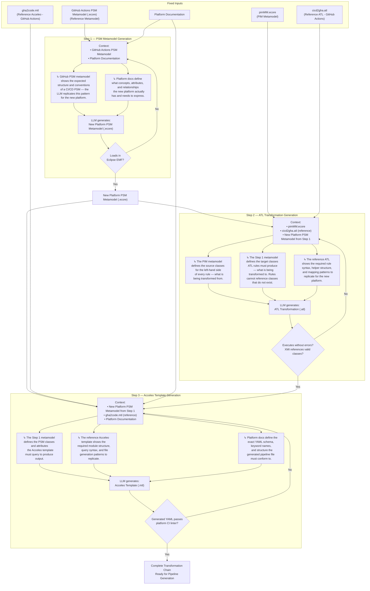

```mermaid
flowchart TD
subgraph inputs["Fixed Inputs"]
GHA_MM["GitHub Actions PSM Metamodel (.ecore)\n(Reference Metamodel)"]
PIM["pimMM.ecore\n(PIM Metamodel)"]
REF_ATL["cicd2gha.atl\n(Reference ATL - GitHub Actions)"]
REF_MTL["gha2code.mtl\n(Reference Acceleo - GitHub Actions)"]
DOCS["Platform Documentation"]
end

    subgraph step1["Step 1 — PSM Metamodel Generation"]
        CTX1["Context:\n• GitHub Actions PSM Metamodel\n• Platform Documentation"]
        R1A["↳ GitHub PSM metamodel shows the expected structure and conventions\n   of a CI/CD PSM — the LLM replicates this pattern for the new platform."]
        R1B["↳ Platform docs define what concepts, attributes, and relationships\n   the new platform actually has and needs to express."]
        GEN1["LLM generates:\nNew Platform PSM Metamodel (.ecore)"]
        VAL1{"Loads in\nEclipse EMF?"}
        CTX1 --> R1A & R1B --> GEN1 --> VAL1
        VAL1 -- No --> CTX1
    end

    subgraph step2["Step 2 — ATL Transformation Generation"]
        CTX2["Context:\n• pimMM.ecore\n• cicd2gha.atl (reference)\n• New Platform PSM Metamodel from Step 1"]
        R2A["↳ The PIM metamodel defines the source classes for the left-hand side\n   of every rule — what is being transformed from."]
        R2B["↳ The Step 1 metamodel defines the target classes ATL rules must produce\n   — what is being transformed to. Rules cannot reference classes that do not exist."]
        R2C["↳ The reference ATL shows the required rule syntax, helper structure,\n   and mapping patterns to replicate for the new platform."]
        GEN2["LLM generates:\nATL Transformation (.atl)"]
        VAL2{"Executes without errors?\nXMI references valid classes?"}
        CTX2 --> R2A & R2B & R2C --> GEN2 --> VAL2
        VAL2 -- No --> CTX2
    end

    subgraph step3["Step 3 — Acceleo Template Generation"]
        CTX3["Context:\n• New Platform PSM Metamodel from Step 1\n• gha2code.mtl (reference)\n• Platform Documentation"]
        R3A["↳ The Step 1 metamodel defines the PSM classes and attributes\n   the Acceleo template must query to produce output."]
        R3B["↳ The reference Acceleo template shows the required module structure,\n   query syntax, and file generation patterns to replicate."]
        R3C["↳ Platform docs define the exact YAML schema, keyword names,\n   and structure the generated pipeline file must conform to."]
        GEN3["LLM generates:\nAcceleo Template (.mtl)"]
        VAL3{"Generated YAML passes\nplatform CI linter?"}
        CTX3 --> R3A & R3B & R3C --> GEN3 --> VAL3
        VAL3 -- No --> CTX3
    end

    GHA_MM --> CTX1
    DOCS --> CTX1
    VAL1 -- Yes --> PSM_OUT["New Platform PSM Metamodel (.ecore)"]
    PSM_OUT --> CTX2
    PSM_OUT --> CTX3
    PIM --> CTX2
    REF_ATL --> CTX2
    REF_MTL --> CTX3
    DOCS --> CTX3
    VAL2 -- Yes --> CTX3
    VAL3 -- Yes --> OUT["Complete Transformation Chain\nReady for Pipeline Generation"]
```
