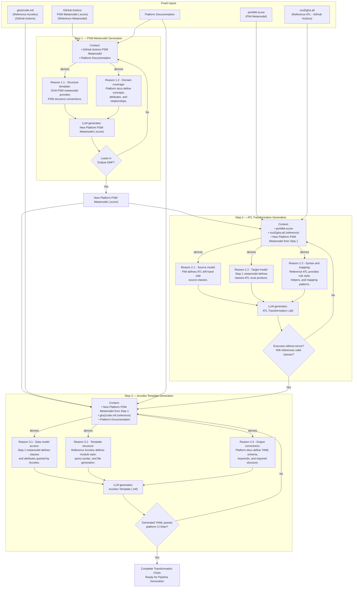

```mermaid
flowchart TD
subgraph inputs["Fixed Inputs"]
GHA_MM["GitHub Actions\nPSM Metamodel (.ecore)\n(Reference Metamodel)"]
PIM["pimMM.ecore\n(PIM Metamodel)"]
REF_ATL["cicd2gha.atl\n(Reference ATL - GitHub Actions)"]
REF_MTL["gha2code.mtl\n(Reference Acceleo)\n(GitHub Actions)"]
DOCS["Platform Documentation"]
end

    subgraph step1["Step 1 — PSM Metamodel Generation"]
        CTX1["Context:\n• GitHub Actions PSM Metamodel\n• Platform Documentation"]
        R1A["Reason 1.1 - Structure template:\nGHA PSM metamodel provides\nPSM structure conventions."]
        R1B["Reason 1.2 - Domain coverage:\nPlatform docs define concepts,\nattributes, and relationships."]
        GEN1["LLM generates:\nNew Platform PSM Metamodel (.ecore)"]
        VAL1{"Loads in\nEclipse EMF?"}
        CTX1 -- derives --> R1A
        CTX1 -- derives --> R1B
        R1A --> GEN1
        R1B --> GEN1
        GEN1 --> VAL1
        VAL1 -- No --> CTX1
    end

    subgraph step2["Step 2 — ATL Transformation Generation"]
        CTX2["Context:\n• pimMM.ecore\n• cicd2gha.atl (reference)\n• New Platform PSM Metamodel from Step 1"]
        R2A["Reason 2.1 - Source model:\nPIM defines ATL left-hand side\nsource classes."]
        R2B["Reason 2.2 - Target model:\nStep 1 metamodel defines\nclasses ATL must produce."]
        R2C["Reason 2.3 - Syntax and mapping:\nReference ATL provides rule style,\nhelpers, and mapping patterns."]
        GEN2["LLM generates:\nATL Transformation (.atl)"]
        VAL2{"Executes without errors?\nXMI references valid classes?"}
        CTX2 -- derives --> R2A
        CTX2 -- derives --> R2B
        CTX2 -- derives --> R2C
        R2A --> GEN2
        R2B --> GEN2
        R2C --> GEN2
        GEN2 --> VAL2
        VAL2 -- No --> CTX2
    end

    subgraph step3["Step 3 — Acceleo Template Generation"]
        CTX3["Context:\n• New Platform PSM Metamodel from Step 1\n• gha2code.mtl (reference)\n• Platform Documentation"]
        R3A["Reason 3.1 - Data model access:\nStep 1 metamodel defines classes\nand attributes queried by Acceleo."]
        R3B["Reason 3.2 - Template structure:\nReference Acceleo defines module style,\nquery syntax, and file generation."]
        R3C["Reason 3.3 - Output correctness:\nPlatform docs define YAML schema,\nkeywords, and required structure."]
        GEN3["LLM generates:\nAcceleo Template (.mtl)"]
        VAL3{"Generated YAML passes\nplatform CI linter?"}
        CTX3 -- derives --> R3A
        CTX3 -- derives --> R3B
        CTX3 -- derives --> R3C
        R3A --> GEN3
        R3B --> GEN3
        R3C --> GEN3
        GEN3 --> VAL3
        VAL3 -- No --> CTX3
    end

    GHA_MM --> CTX1
    DOCS --> CTX1
    VAL1 -- Yes --> PSM_OUT["New Platform PSM Metamodel (.ecore)"]
    PSM_OUT --> CTX2
    PSM_OUT --> CTX3
    PIM --> CTX2
    REF_ATL --> CTX2
    REF_MTL --> CTX3
    DOCS --> CTX3
    VAL2 -- Yes --> CTX3
    VAL3 -- Yes --> OUT["Complete Transformation Chain\nReady for Pipeline Generation"]
```
