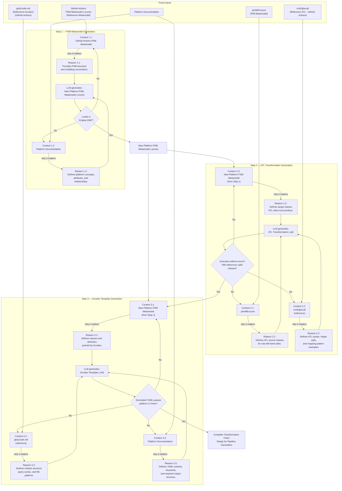

```mermaid
flowchart TD
subgraph inputs["Fixed Inputs"]
GHA_MM["GitHub Actions\nPSM Metamodel (.ecore)\n(Reference Metamodel)"]
PIM["pimMM.ecore\n(PIM Metamodel)"]
REF_ATL["cicd2gha.atl\n(Reference ATL - GitHub Actions)"]
REF_MTL["gha2code.mtl\n(Reference Acceleo)\n(GitHub Actions)"]
DOCS["Platform Documentation"]
end

    subgraph step1["Step 1 — PSM Metamodel Generation"]
        C11["Context 1.1:\nGitHub Actions PSM Metamodel"]
        C12["Context 1.2:\nPlatform Documentation"]
        R1A["Reason 1.1:\nProvides PSM structure\nand modeling conventions."]
        R1B["Reason 1.2:\nDefines platform concepts,\nattributes, and relationships."]
        GEN1["LLM generates:\nNew Platform PSM Metamodel (.ecore)"]
        VAL1{"Loads in\nEclipse EMF?"}
        C11 -- why it matters --> R1A
        C12 -- why it matters --> R1B
        R1A --> GEN1
        R1B --> GEN1
        GEN1 --> VAL1
        VAL1 -- No --> C11
        VAL1 -- No --> C12
    end

    subgraph step2["Step 2 — ATL Transformation Generation"]
        C21["Context 2.1:\npimMM.ecore"]
        C22["Context 2.2:\ncicd2gha.atl\n(reference)"]
        C23["Context 2.3:\nNew Platform PSM Metamodel\n(from Step 1)"]
        R2A["Reason 2.1:\nDefines ATL source classes\nfor rule left-hand sides."]
        R2B["Reason 2.2:\nDefines ATL syntax, helper style,\nand mapping pattern examples."]
        R2C["Reason 2.3:\nDefines target classes\nATL rules must produce."]
        GEN2["LLM generates:\nATL Transformation (.atl)"]
        VAL2{"Executes without errors?\nXMI references valid classes?"}
        C21 -- why it matters --> R2A
        C22 -- why it matters --> R2B
        C23 -- why it matters --> R2C
        R2A --> GEN2
        R2B --> GEN2
        R2C --> GEN2
        GEN2 --> VAL2
        VAL2 -- No --> C21
        VAL2 -- No --> C22
        VAL2 -- No --> C23
    end

    subgraph step3["Step 3 — Acceleo Template Generation"]
        C31["Context 3.1:\nNew Platform PSM Metamodel\n(from Step 1)"]
        C32["Context 3.2:\ngha2code.mtl\n(reference)"]
        C33["Context 3.3:\nPlatform Documentation"]
        R3A["Reason 3.1:\nDefines classes and attributes\nqueried by Acceleo."]
        R3B["Reason 3.2:\nDefines module structure,\nquery syntax, and file patterns."]
        R3C["Reason 3.3:\nDefines YAML schema, keywords,\nand required output structure."]
        GEN3["LLM generates:\nAcceleo Template (.mtl)"]
        VAL3{"Generated YAML passes\nplatform CI linter?"}
        C31 -- why it matters --> R3A
        C32 -- why it matters --> R3B
        C33 -- why it matters --> R3C
        R3A --> GEN3
        R3B --> GEN3
        R3C --> GEN3
        GEN3 --> VAL3
        VAL3 -- No --> C31
        VAL3 -- No --> C32
        VAL3 -- No --> C33
    end

    GHA_MM --> C11
    DOCS --> C12
    VAL1 -- Yes --> PSM_OUT["New Platform PSM Metamodel (.ecore)"]
    PIM --> C21
    REF_ATL --> C22
    PSM_OUT --> C23
    PSM_OUT --> C31
    REF_MTL --> C32
    DOCS --> C33
    VAL2 -- Yes --> C31
    VAL3 -- Yes --> OUT["Complete Transformation Chain\nReady for Pipeline Generation"]
```
