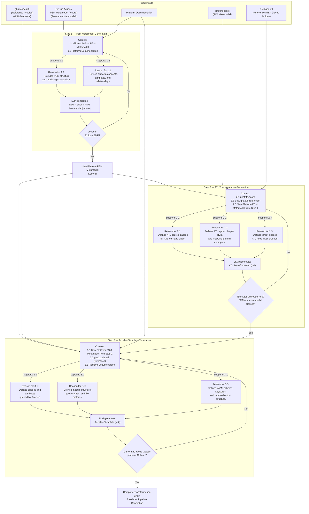

```mermaid
flowchart TD
subgraph inputs["Fixed Inputs"]
GHA_MM["GitHub Actions<br/>PSM Metamodel (.ecore)<br/>(Reference Metamodel)"]
PIM["pimMM.ecore<br/>(PIM Metamodel)"]
REF_ATL["cicd2gha.atl<br/>(Reference ATL - GitHub Actions)"]
REF_MTL["gha2code.mtl<br/>(Reference Acceleo)<br/>(GitHub Actions)"]
DOCS["Platform Documentation"]
end

    subgraph step1["Step 1 — PSM Metamodel Generation"]
        CTX1["Context:<br/>1.1 GitHub Actions PSM Metamodel<br/>1.2 Platform Documentation"]
        R1A["Reason for 1.1:<br/>Provides PSM structure<br/>and modeling conventions."]
        R1B["Reason for 1.2:<br/>Defines platform concepts,<br/>attributes, and relationships."]
        GEN1["LLM generates:<br/>New Platform PSM Metamodel (.ecore)"]
        VAL1{"Loads in<br/>Eclipse EMF?"}
        CTX1 -- supports 1.1 --> R1A
        CTX1 -- supports 1.2 --> R1B
        R1A --> GEN1
        R1B --> GEN1
        GEN1 --> VAL1
        VAL1 -- No --> CTX1
    end

    subgraph step2["Step 2 — ATL Transformation Generation"]
        CTX2["Context:<br/>2.1 pimMM.ecore<br/>2.2 cicd2gha.atl (reference)<br/>2.3 New Platform PSM Metamodel from Step 1"]
        R2A["Reason for 2.1:<br/>Defines ATL source classes<br/>for rule left-hand sides."]
        R2B["Reason for 2.2:<br/>Defines ATL syntax, helper style,<br/>and mapping pattern examples."]
        R2C["Reason for 2.3:<br/>Defines target classes<br/>ATL rules must produce."]
        GEN2["LLM generates:<br/>ATL Transformation (.atl)"]
        VAL2{"Executes without errors?<br/>XMI references valid classes?"}
        CTX2 -- supports 2.1 --> R2A
        CTX2 -- supports 2.2 --> R2B
        CTX2 -- supports 2.3 --> R2C
        R2A --> GEN2
        R2B --> GEN2
        R2C --> GEN2
        GEN2 --> VAL2
        VAL2 -- No --> CTX2
    end

    subgraph step3["Step 3 — Acceleo Template Generation"]
        CTX3["Context:<br/>3.1 New Platform PSM Metamodel from Step 1<br/>3.2 gha2code.mtl (reference)<br/>3.3 Platform Documentation"]
        R3A["Reason for 3.1:<br/>Defines classes and attributes<br/>queried by Acceleo."]
        R3B["Reason for 3.2:<br/>Defines module structure,<br/>query syntax, and file patterns."]
        R3C["Reason for 3.3:<br/>Defines YAML schema, keywords,<br/>and required output structure."]
        GEN3["LLM generates:<br/>Acceleo Template (.mtl)"]
        VAL3{"Generated YAML passes<br/>platform CI linter?"}
        CTX3 -- supports 3.1 --> R3A
        CTX3 -- supports 3.2 --> R3B
        CTX3 -- supports 3.3 --> R3C
        R3A --> GEN3
        R3B --> GEN3
        R3C --> GEN3
        GEN3 --> VAL3
        VAL3 -- No --> CTX3
    end

    GHA_MM --> CTX1
    DOCS --> CTX1
    VAL1 -- Yes --> PSM_OUT["New Platform PSM Metamodel<br/>(.ecore)"]
    PSM_OUT --> CTX2
    PSM_OUT --> CTX3
    PIM --> CTX2
    REF_ATL --> CTX2
    REF_MTL --> CTX3
    DOCS --> CTX3
    VAL2 -- Yes --> CTX3
    VAL3 -- Yes --> OUT["Complete Transformation Chain<br/>Ready for Pipeline Generation"]
```
