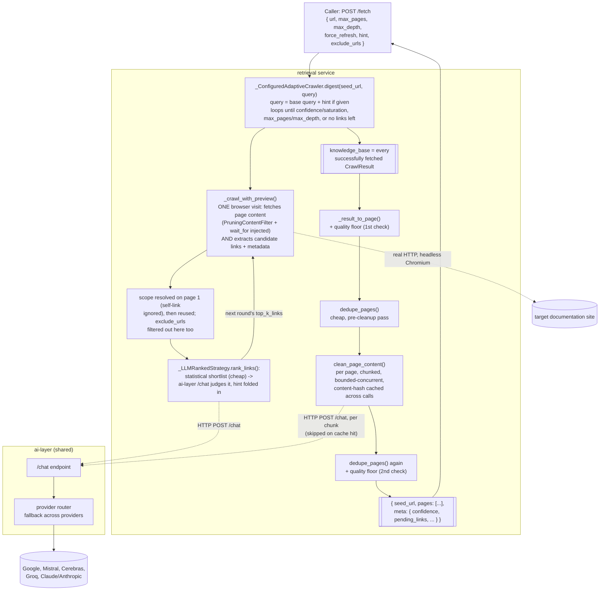

# retrieval

Fetches CI/CD platform documentation from a URL and returns clean markdown, for use by
downstream generation agents (PSM/ATL/Acceleo). Implements issue #220.

## What it fetches

Not general documentation, specifically a platform's configuration syntax reference: the
keyword-by-keyword schema for its pipeline definition file. GitLab CI's
[yaml reference](https://docs.gitlab.com/ci/yaml/) is the model case, every field (`stages`,
`rules`, `needs`, `artifacts`, ...) with its type and meaning. Some platforms keep this on
one page, others scatter it across several. When a seed page doesn't contain everything on
its own, the service crawls further, real multi-hop, not just links visible on the seed page,
via `AdaptiveCrawler` (see Architecture).

Tested against a spread of real CI/CD platforms, including at least one whose docs have no
single consolidated reference page and scatter the schema across many independent topic pages,
a deliberately hard case. Each is run end-to-end against the live site with real content-quality
checks (fenced code blocks present, zero leftover cookie/nav chrome), not just page-count
numbers, see Testing.

## Architecture

`retrieval` runs as its own service, separate from the shared `ai-layer` service that other
agents use. It needs a real headless browser (Playwright/Chromium) to render JS-heavy
documentation sites correctly; `ai-layer` and the other agents don't, so that dependency
isn't bundled into their container.

Every LLM call (page-relevance ranking, content cleanup) goes through `ai-layer`'s `/chat`
endpoint over HTTP rather than importing the router in-process, since the two run in separate
containers with no shared filesystem. `AI_LAYER_URL` (default `http://ai-layer:8000`,
matching the Docker Compose service name) controls where that call goes.

### Who does what

Crawling is driven by Crawl4AI's `AdaptiveCrawler`, not a hand-rolled seed-plus-links loop: it
does real multi-hop traversal (links found on follow-up pages are considered too, not just the
seed's own links) and loops rounds of *fetch → extract candidate links → rank → pick the next
batch* until it stops.

1. **Fetching a page and extracting its content + candidate links happens together, in one
   browser visit.** `_ConfiguredAdaptiveCrawler._crawl_with_preview(url, query)` calls
   Crawl4AI's real headless Chromium (`crawler.arun()`) once per page. `AdaptiveCrawler`
   hardcodes its own internal `CrawlerRunConfig` for this call, with no public parameter to
   inject a custom one, so this project's tuned `PruningContentFilter` (structural content
   cleanup, see Content filtering) and `wait_for` (JS-render wait) would otherwise silently not
   apply. Overriding the method is the way this injects them while keeping real multi-hop
   traversal. The same call also extracts every internal link on the page plus lightweight
   metadata (title, link text) for each; this is what candidate links for the *next* hop come
   from, bounded by the `MAX_LINKS` env var (see Configuration).
2. **Scope resolution** happens next, mechanically, no LLM. `AdaptiveCrawler`'s scoring has no
   page-content understanding and can rank an unrelated same-domain product page highly just
   because it happens to share query terms. `_scope_prefixes(seed_url)` computes a list of
   progressively broader domain+path prefixes (narrowest first); on the first page fetch,
   `_crawl_with_preview` tries each in order and locks in the narrowest one that actually has
   matching candidate links (excluding the page's own self-link, e.g. a breadcrumb or canonical
   tag pointing back at itself, which would otherwise trivially "match" the narrowest prefix
   without representing any real coverage). That resolved scope then stays fixed for every
   later hop so it doesn't drift. A single fixed path-segment depth doesn't work across every
   platform's URL shape, the adaptive widening exists specifically for that.
3. **Ranking which of the scoped, in-budget candidates to fetch next** is a two-stage filter,
   `_LLMRankedStrategy.rank_links()`. Crawl4AI's own statistical scoring (BM25 if available,
   otherwise term overlap between the query and a candidate's text/title/meta) runs first,
   free, no LLM call, purely to order candidates and provide a fallback ranking, not to
   gatekeep what the LLM even gets to see; the shortlist width is the `SHORTLIST_SIZE` env var
   (see Configuration), wide enough that a page correct but statistically unremarkable still
   reaches the LLM. The shortlist goes to `_llm_rank_links()`, a real HTTP call to `ai-layer`'s
   shared `/chat`, asking it which candidates actually look like syntax/schema reference pages
   rather than a tutorial, marketing, or unrelated same-platform page, a judgment the
   statistical score alone can't make. `AdaptiveCrawler`'s own `"embedding"`/`"llm"` strategy
   options are not used for this since both call an external LLM/embedding provider directly
   (confirmed in `EmbeddingStrategy`'s source), with no way to redirect that call through
   `ai-layer`, the same reason `LLMContentFilter` isn't used for cleanup.
4. **Stopping** is `AdaptiveCrawler`'s own loop (unmodified), and it has more stop paths than
   just "budget exhausted": each round it checks confidence/saturation against the query,
   `max_pages`, and whether any candidate links are left; separately, after ranking, it also
   stops if the top-ranked candidate's score falls below `min_gain_threshold` (a quality gate,
   not a budget one) or if nothing survives scope/exclude filtering that round. Confidence and
   saturation are deliberately pushed close to their maximum (see Design decisions) so they
   rarely fire in practice, `max_pages`, exhausted candidates, and `min_gain_threshold` are the
   stop paths that actually govern most real runs, not one single condition. This matters for
   reading `meta`: a non-empty `pending_links` doesn't by itself mean the budget ran out, see
   API for how to tell the difference. `max_pages` is also a soft cap, not a hard one:
   `AdaptiveCrawler` checks it once per round but then crawls a whole batch (`top_k_links`
   candidates) before checking again, so a run can return more pages than requested.

Once `digest()` returns every successfully fetched page (`state.knowledge_base`),
`fetch_documentation()` takes over for cleanup, sequentially, no more crawling:

5. `_result_to_page()` shapes each result and applies the content-length quality floor (a page
   can report success with almost no real content, see Content filtering).
6. `dedupe_pages()` runs once, cheap, deterministic, no LLM, before any cleanup call.
7. `clean_page_content()` runs per page, chunked, each page's chunks cleaned concurrently
   (bounded), another real `ai-layer` `/chat` call per chunk, cached by content hash so an
   identical chunk seen again (common across retries) skips the LLM call entirely (see
   Content filtering).
8. `dedupe_pages()` runs again, plus the quality floor is re-checked (cleanup and dedup can
   leave a page hollowed out even if it started fine).
9. The assembled `{seed_url, pages, meta}` is what `main.py`'s `/fetch` endpoint returns.

No automatic ranking is ever going to be perfect: the LLM judging candidates in step 3 only
ever sees a link's title/text/meta description, never the target page's real content, before
deciding whether to visit it (reading every candidate first would defeat the point of a cheap
pre-filter). So there's a real, structural ceiling on how good a single automatic pass can be.
Rather than chase an unreachable "perfect automatically" bar, `hint`, `max_depth`,
`exclude_urls`, and `meta` (all documented under API) exist to make a *retry* cheap and
targeted instead: an orchestrator or a human should be able to inspect what a first pass got,
decide what's actually missing or wrong, and correct it directly rather than hope a fresh
crawl does better blind.



## API

### `POST /fetch`

```json
{
  "url": "https://docs.gitlab.com/ci/",
  "max_pages": 5,
  "max_depth": 5,
  "force_refresh": false,
  "hint": null,
  "exclude_urls": null
}
```

`url` must be a valid URL (rejected with 422 otherwise). `max_pages` and `max_depth` are each
bounded and defaulted by an environment variable (see Configuration), operator-tunable without
a code change. `force_refresh` bypasses both Crawl4AI's page cache and the content-cleanup
cache for a fully fresh crawl (see Content filtering).

`hint` (optional, bounded length) and `exclude_urls` (optional list of URLs) are the retry
levers described in Architecture: `hint` is free text folded into both the statistical
pre-filter's query and the LLM ranking prompt, e.g. `"prioritize pages about environment
variables and secrets"`; `exclude_urls` rules out specific URLs a caller already knows were
wrong or unhelpful, so the ranking can't pick them again.

Returns:

```json
{
  "seed_url": "https://docs.gitlab.com/ci/",
  "pages": [
    { "url": "...", "success": true, "status_code": 200, "markdown": "...", "links": ["..."] }
  ],
  "meta": {
    "confidence": 0.79,
    "pages_crawled": 4,
    "depth_reached": 1,
    "pending_links": [
      { "href": "https://docs.gitlab.com/ci/yaml/needs/", "text": "needs", "title": "..." }
    ]
  }
}
```

`meta` exists precisely so a caller can tell which kind of retry makes sense. A non-empty
`pending_links` means real, already-scoped, already-seen candidates are still available, hand
one of these exact links straight to `POST /fetch/page` instead of re-crawling, that always
works regardless of why the crawl stopped. It does not by itself mean the page/depth budget was
the cause: `AdaptiveCrawler` also stops when the best remaining candidate's ranking score falls
below its quality gate, in which case `pending_links` is non-empty but raising `max_pages` does
nothing, since the crawl wasn't budget-limited, `hint` (steer the ranking) or `exclude_urls` are
the levers that actually help there. `pages_crawled` close to `max_pages` (or `depth_reached`
close to `max_depth`) is the signal that it really was a budget stop, worth raising one of
those; well under either, treat it as the ranking gate and reach for `hint` instead. An empty
`pending_links` means it genuinely ran out of in-scope candidates entirely, no budget or hint
changes that, only a different seed URL or `exclude_urls`-driven rescoping would.

### `POST /fetch/page`

```json
{ "url": "https://docs.gitlab.com/ci/yaml/needs/", "force_refresh": false }
```

Fetches and cleans exactly one URL, no crawling, no link-following, no ranking, same
structural filter + `wait_for` + cleanup pass as every page inside `/fetch`. The targeted half
of the retry story: a caller who already knows the exact URL that's missing (from a prior
response's `pages[].links` or `meta.pending_links`, or their own knowledge of the site) can
pull it in directly and merge it into their own accumulated results, cheaper and more precise
than re-running a full crawl to reach one page. Returns a page dict shaped identically to one
entry of `/fetch`'s `pages` array.

`GET /health` returns `{"status": "ok"}`.

## Configuration

Every tuning value in the service (page/link/depth budgets and limits, timeouts, cache sizes,
content-filter thresholds, chunking and concurrency, quality-floor and dedup thresholds, the
statistical ranking query terms, and the two LLM system prompts) has its default in
[`config.yaml`](config.yaml), checked in next to `retrieval.py`, so tuning it doesn't require
editing Python source. The numeric/threshold keys are additionally overridable per-deploy via
an environment variable of the same name (`config.yaml`'s value is only the fallback default);
`QUERY`, `LINK_RANKING_PROMPT`, and `CLEAN_CONTENT_PROMPT` have no environment variable
equivalent, edit `config.yaml` directly for those. `retrieval.py` loads `config.yaml` at import
time into the same module-level constants it always had (`_MAX_LINKS`, `DEFAULT_MAX_PAGES`,
etc., the latter two plus `MAX_PAGES_LIMIT`/`MAX_DEPTH_LIMIT` are imported into `main.py` for
request validation; `main.py` also has its own `MAX_HINT_LENGTH` env var for the request-shaping
bound that isn't in `config.yaml`). This file intentionally doesn't restate exact numbers that
live in `config.yaml`, to avoid the two drifting apart. None of these are per-request `/fetch`
parameters: unlike `hint`/`max_depth`/`exclude_urls`, a caller has no principled basis to pick a
different value per call, they're operational knobs, not retry levers.

The two prompt keys have load-bearing constraints beyond their obvious meaning, noted as
comments directly above each key in `config.yaml`: `LINK_RANKING_PROMPT`'s instruction to
respond with only a JSON array is what `_llm_rank_links`'s regex parsing depends on, and
`CLEAN_CONTENT_PROMPT`'s byte-for-byte fidelity requirement is what `_clean_chunk`'s
length-growth guard depends on. Read those comments before editing either prompt.

## Content filtering

Cleanup is layered, each stage catches what the one before it structurally can't.

1. **`PruningContentFilter`** (structural, per-page, injected into `AdaptiveCrawler`'s fetch
   via `_ConfiguredAdaptiveCrawler`). Its density/tag-weight threshold is the library's own
   default; `min_word_threshold` and `preserve_tags` have no library default at all, these are
   the real additions: raw HTML-to-markdown keeps the entire page including navigation chrome;
   without `preserve_tags`, code-block-heavy pages lose syntax to the density/tag-weight score;
   without a word floor, prose-style pages with short definitions lose content to
   short-paragraph pruning.
2. **Scope resolution + `_LLMRankedStrategy`** (per-hop, before a page is even fetched). Keeps
   multi-hop traversal on the platform's own docs and picks pages an LLM judges as likely
   schema/reference content, not just whatever scores highest on raw term overlap. See
   Architecture for why both exist.
3. **`clean_page_content()`** (semantic, per-page, via `ai-layer`'s shared `/chat`, chunked and
   cleaned concurrently with bounded concurrency, `asyncio.gather` plus a semaphore, rather than
   one chunk at a time, since sequential chunking on a large page cost real, noticeable time).
   `PruningContentFilter` is purely structural with no understanding of meaning, and can let
   through well-formed boilerplate (e.g. a cookie-consent paragraph) since it scores just like
   real content structurally. An LLM pass, instructed to remove chrome and return everything
   else byte-for-byte unchanged, catches what the heuristic can't. `LLMContentFilter`
   (Crawl4AI's own built-in option) is deliberately not used, it needs its own separate
   `provider`/`api_token`, bypassing `ai-layer`'s shared router entirely. Results are cached
   in-process, keyed by a hash of the input chunk (not the URL, so it's naturally correct if a
   URL's content genuinely changes, and just as naturally reusable if identical content happens
   to repeat across different pages): a retry that re-visits pages it already cleaned skips
   those LLM calls entirely. `force_refresh` bypasses this cache too, not just Crawl4AI's page
   cache, so "give me a truly fresh result" means fresh all the way through.
4. **`dedupe_pages()`** (deterministic, across all fetched pages), called **twice**: once
   before `clean_page_content` (cheap, so an obvious cross-page repeat never reaches an LLM
   call at all, reducing cleanup cost) and once after (a safety net for whatever cleanup left
   inconsistent). Drops a paragraph over a length threshold if it already appeared on an
   earlier page; short repeats (headings, single lines) are left alone. Since it only ever
   drops *later* occurrences, it can never help the very first page a piece of chrome appears
   on, only later repeats of it.
5. **Content-length quality floor**, checked twice: once in `_result_to_page` on the
   originally-fetched content, and again after both dedup passes. A page can report success
   with real HTTP status but almost no usable content (a near-duplicate query-string variant of
   an already-fetched page is a real example of this), and neither the success flag nor the
   status code alone catches it. The second check exists because a page can legitimately start
   well over the floor and still end up hollowed out: `dedupe_pages` correctly recognizing it
   as a near-total repeat of an already-captured sibling page can leave almost nothing behind.

Crawl4AI's own page cache (enabled by default) has no TTL, so a doc page fetched by an earlier
request is served instantly on a later one, but never expires on its own. `force_refresh=true`
on `/fetch` or `/fetch/page` bypasses it and the separate content-cleanup cache described
above, for a caller that knows a page changed. Robots.txt is respected on every fetch.

## Local development

```
python -m venv venv
venv\Scripts\activate
pip install -r requirements.txt
crawl4ai-setup
uvicorn main:app --reload --port 8010
```

Two environment variables keep Playwright's browser binary and crawl4ai's own cache/db inside
this folder instead of the user profile. Note the base-directory variable name has an extra
underscore (`CRAWL4_AI`, not `CRAWL4AI`), since published docs/blog posts commonly get this
wrong; the wrong name is silently ignored, no error, it just writes to the user's home
directory as if unset:

```
PLAYWRIGHT_BROWSERS_PATH = <repo>\ai\retrieval\.playwright-browsers
CRAWL4_AI_BASE_DIRECTORY = <repo>\ai\retrieval
```

(crawl4ai appends `.crawl4ai` to that path itself, don't include it in the env var value.)

`venv/`, `.playwright-browsers/`, and `.crawl4ai/` are gitignored at the repo root.

`AI_LAYER_URL` (see `.env.example`) defaults to `http://ai-layer:8000`, the Docker Compose
service name, which only resolves inside the Docker network. Running this service directly on
the host (`uvicorn main:app --reload`) against a host-based `ai-layer`, set
`AI_LAYER_URL=http://localhost:8000` first, otherwise every ranking and content-cleanup call
fails to resolve the hostname.

## Docker

Built from `python:3.12-slim`, not Microsoft's Playwright base image, that image preinstalls
Chromium, Firefox, and WebKit when only Chromium is ever used here. `crawl4ai-setup` installs
Chromium (via `patchright`) and its OS-level dependencies itself, keeping the image
substantially smaller. Crawl4AI also publishes its own official Docker image (a full FastAPI
server with a dashboard/playground/MCP endpoints, meant to be run as a separate sidecar service
other apps call over HTTP), not adopted here since this service needs custom per-page logic
(chunked LLM cleanup, dedup, LLM-driven ranking) with no equivalent in that server's REST
surface, adopting it would mean restructuring retrieval to call it as a client rather than
embed it as a library, a bigger architectural change than a Dockerfile swap.

Runs via `docker-compose.yml` in the parent `ai/` directory as the `retrieval` service,
internal-only (`expose`, not `ports`), reachable by other services on the Docker network but
not from the host browser.

Runs as a non-root user (the container user/home directory is created and `HOME` is pointed at
it before `crawl4ai-setup` runs, so the browser cache and crawl4ai's state land somewhere that
user can actually read), with `cap_drop: ALL` and `no-new-privileges` (safe since crawl4ai
already hardcodes `--no-sandbox` and `--disable-dev-shm-usage` into every Chromium launch
unconditionally, so no elevated capabilities are needed either way), `init: true` to reap
zombie Chromium/zygote processes, and a `HEALTHCHECK`.

## Security

- **SSRF.** `/fetch` and `/fetch/page` accept a caller-supplied URL and drive a real browser at
  it; with no restriction, a caller could point either at an internal service on the same
  Docker network, `localhost`, or a cloud metadata endpoint and have it rendered and returned.
  `_validate_fetchable_url()` resolves the hostname and rejects anything private, loopback,
  link-local, reserved, or multicast, called before every fetch in both
  `_ConfiguredAdaptiveCrawler._crawl_with_preview` and `fetch_single_page`.
- **Prompt injection via page content.** `clean_page_content` sends full, untrusted,
  attacker-reachable page markdown to an LLM with instructions to return it byte-for-byte
  unchanged except for chrome removal; a page could attempt to smuggle instructions into its
  own text. Not fully solvable (the whole point of this pass is letting an LLM rewrite
  content), but `_clean_chunk` rejects any result that comes back meaningfully longer than its
  input, cleanup's entire job is removing chrome, so legitimate output should never grow,
  catching the cheap, common injection shape (appended/expanded content) even though it can't
  catch a same-length substitution. `hint` (free text from the caller, folded into the ranking
  prompt) has the same category of risk but bounded impact: `_llm_rank_links` only ever accepts
  hrefs that were in the real candidate list, so an injected instruction can degrade ranking
  quality for that request, not redirect the crawl anywhere.

## Design decisions

**Crawl4AI** (Apache 2.0) over two alternatives:

- **trafilatura**, the original candidate for this issue, does a plain HTTP fetch plus static
  HTML parsing. It handles static doc sites fine but returns a near-empty page on JS-rendered
  SPA docs. Its `focused_crawler()` is also not AI-based, it's a heuristic URL filter that
  prioritizes navigation-looking pages, not semantic relevance.
- **Firecrawl** handles JS and page selection well, but its self-hostable core is AGPL-3.0
  (only the SDKs are MIT), the same license category already ruled out for other tools on this
  project.
- **GcrawlAI**, a newer entrant, was checked and ruled out: a small, young project whose
  architecture (Postgres, Redis, Celery, a separate frontend) means adopting it would mean
  standing up a distributed app to replace what's currently one library call.
- **Crawl4AI** drives a real headless browser (Playwright), so it renders JS-heavy docs
  correctly.

**`wait_for` over `wait_until="networkidle"`.** Playwright's own docs mark `networkidle`
explicitly **DISCOURAGED**: *"consider operation to be finished when there are no network
connections for at least 500ms... Don't use this method for testing"*, a single long-polling
connection (analytics, a websocket) can hang it indefinitely. Crawl4AI's own Page Interaction
guide is built around `wait_for` instead (a CSS selector or JS condition), never mentions
`wait_until` at all. `wait_for` waits for the page to actually have substantial rendered text
rather than guessing a fixed delay or depending on network activity.

**`AdaptiveCrawler` over a hand-rolled single-hop loop.** A single-hop design (fetch the seed
page, ask an LLM which of its own links to follow, stop) never considers links found on the
pages it visits. `AdaptiveCrawler` gives real multi-hop traversal and a principled stopping
criterion out of the box; the integration problems it introduces (config injection, scope
resolution, ranking shortlist width) are covered in Architecture above.

**`arun_many`/dispatcher concurrency**: not added separately, `AdaptiveCrawler`'s own per-round
batch fetch already uses `asyncio.gather` internally, so the "fetch several independent pages
in parallel" concern this would otherwise address is already handled by adopting
`AdaptiveCrawler` itself.

**Retry levers (`hint`, `exclude_urls`, `meta`, `/fetch/page`) instead of trying to make
ranking perfect.** The LLM ranking step is fundamentally limited to judging a candidate by its
title/text/meta, never its actual content, before deciding whether to fetch it, no amount of
prompt tuning removes that ceiling. Rather than keep chasing full automatic accuracy, these
give a caller (human or orchestrator) the same kind of control a person correcting a first
draft would want: steer the next attempt (`hint`), rule out a specific known-bad result
(`exclude_urls`), see enough about what happened to decide which lever to pull (`meta`), or
skip re-crawling entirely when the caller already knows the one exact page that's missing
(`/fetch/page`).

## Testing

`pytest` runs this module's unit tests (`tests/test_retrieval_unit.py`, `tests/test_main.py`), all
mocked, no network, browser, or LLM calls (DNS resolution for `_validate_fetchable_url` is
mocked too via an autouse fixture, so a fake test URL never depends on real DNS). Coverage
includes: SSRF rejection (loopback, private ranges, link-local/cloud metadata, unresolvable
hosts), scope filtering (including that `exclude_urls` doesn't corrupt scope resolution), LLM
ranking and its fallback/invented-href handling, `hint` folding into both the query and the
ranking prompt, `exclude_urls` filtering, the config injected into `AdaptiveCrawler`'s fetch,
multi-hop page assembly, `meta` assembly (including pending-link deduplication), request
validation, concurrent chunked cleanup (chunks reassemble in original order not completion
order, concurrency is actually bounded, the content-hash cache hits/misses/force-refreshes
correctly verified by counting real calls not timing, a suspiciously-longer-than-input cleanup
result is rejected), cross-page deduplication (both passes), the content-length quality floor
(both checks), the single-page `/fetch/page` path (including its own graceful-failure
handling), and the FastAPI endpoints' request handling.

Two integration tests, both marked `integration`, excluded from the default run, run explicitly
with `pytest -m integration`, since both hit something real:

- `tests/test_js_rendering.py` launches a real browser against a local static-HTML fixture that
  injects content via a delayed script, mimicking a JS-rendered SPA, verifying the wait-config
  behavior actually works, not just checked by hand once.
- `tests/test_e2e.py` runs `fetch_documentation()` and `fetch_single_page()` for real, real
  browser, real network, real `ai-layer` LLM calls for ranking and cleanup, against a live
  documentation site, then checks the actual response: real syntax keywords present, no leftover
  chrome, content over a real-page-sized floor. The mocked unit tests above exercise this
  module's own logic in isolation; this is what catches an actual crawl4ai/Playwright/ai-layer
  integration break, the kind of thing mocking can't.

Every architectural piece (config injection, scope resolution, shortlist width, `wait_for`,
confidence/saturation calibration, the quality floor, link budget) has been verified by running
the real service against real platform documentation sites with real content-quality checks
(fenced code blocks present, zero leftover cookie/nav chrome), not just page-count numbers; see
`samples/*.md` (gitignored) for the most recent runs.

## Known limitations

- **PDF documentation is not yet handled.** The issue asks for both web pages and PDF
  documents; this module only implements the web-page path. `pdfplumber` is the candidate
  from earlier research for the PDF path, not yet built.
- **Not yet called by anything.** The Orchestrator's PSM stage currently accepts a plain
  text platform description, not a URL, so nothing in the pipeline invokes this service yet.
- **No structured output normalization.** The issue AC asks for "clean text output in a
  consistent structured format"; each page currently returns markdown as-is, with no
  normalization pass across pages.
- **`max_pages`/`max_depth` are soft budgets, not hard caps.** `AdaptiveCrawler` checks its
  stopping condition once per round, not once per page, then crawls up to `TOP_K_LINKS` more
  pages before checking again, so a crawl can overshoot the requested `max_pages` by up to
  `TOP_K_LINKS - 1` pages. Not fixed, a library behavior, not something worth patching around
  for a budget that was never meant to be exact.
- **The in-process content-cleanup cache (and Crawl4AI's own page cache) are per-container,
  not shared.** If `retrieval` ever runs as more than one replica, a cache hit on one instance
  is a cache miss on another. Not a problem at the current single-instance scale; worth
  revisiting (a shared cache, e.g. Redis) if that changes.
- **`_LLMRankedStrategy`'s ranking has only been spot-checked for run-to-run consistency, not
  proven stable across many runs.** Results have looked consistently good in live testing but
  haven't been re-run many times against the same seed URL to statistically confirm stability.
